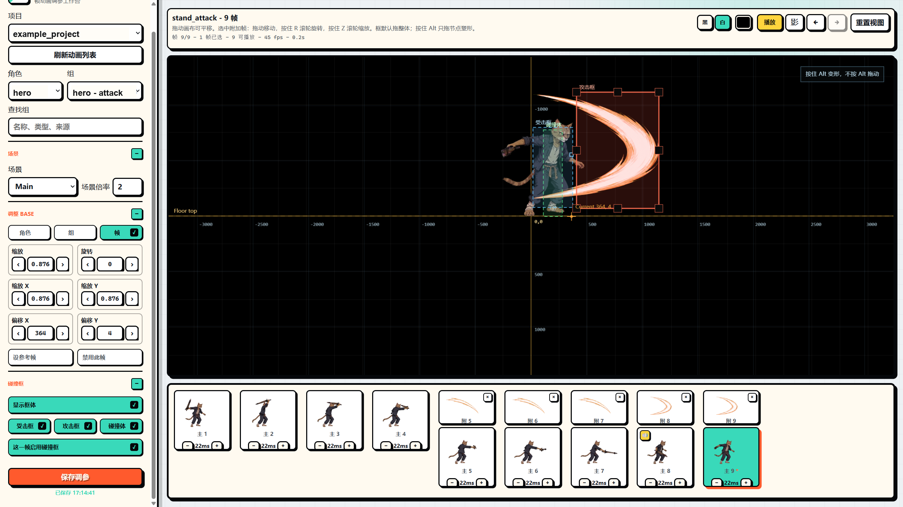

# XSXB Frame Tuner

XSXB Frame Tuner 是一个给 Godot 帧动画角色用的本地调参工作台，配套一个 Codex/Agent skill。它的目标很简单：让 Agent 负责导入、同步和验证素材，让人在网页里直观看帧、拖动角色、调碰撞框，然后把结果保存回 Godot 项目。



## 功能

- 多项目隔离：每个 Godot 项目使用独立的 manifest、tuning、音频绑定、图片挂件和导入素材目录。
- 帧动画预览：支持逐帧选择、播放、暂停、参考帧、黑/白/透明背景和网格坐标。
- 三层变换：角色级、动画组级、单帧级分别保存缩放、偏移、旋转和禁用状态。
- 碰撞框调节：支持 hurtbox、hitbox、collisionbox，在画布中直接拖动和变形。
- 播放调节：支持组级时长、单帧时长、禁用帧，以及调参后的实际播放节奏。
- 帧音效和图片挂件：可以给指定帧绑定 SFX 或附加图片，保存后同步到 Godot 项目。
- Godot 同步：导入 PNG 序列或 SpriteFrames 后，会生成/刷新 `res://xsxb_frame_tuner/` 下的运行时数据和基础 runtime。

这个仓库不包含任何角色 PNG、音频、Godot 私有项目路径或调参数据。运行时产生的项目数据会留在本机，并被 `.gitignore` 排除。

## 仓库内容

- `tools/animation_tuner/`：本地 Webapp，默认服务地址是 `http://127.0.0.1:5179`。
- `tools/import_frames.js`：Agent 用来导入 PNG 序列的内部工具。
- `tools/import_spriteframes.js`：Agent 用来从 Godot `.spriteframes.tres` 导入动画的内部工具。
- `tools/godot_sync.js` 和 `tools/godot_runtime.js`：把调参数据、素材和 runtime 同步到 Godot 项目。
- `skills/xsxb-frame-tuner/`：配套 Codex/Agent skill。
- `data/`、`workspace/`、`audio/`：本地运行时目录。真实项目数据不提交。

## 安装方式

只提供 Agent 安装方式。把下面这段话交给 Codex 或其他支持 skills 的 Agent：

```text
请从 https://github.com/sparklecatta-lang/XSXB-Frame-Tuner 安装并启用 `skills/xsxb-frame-tuner`。
安装后把仓库克隆到本机作为 XSXB Frame Tuner 工具根目录。
以后处理 Godot 帧动画角色导入、动画追加、碰撞框调参、音效/挂件同步时，默认使用 `$xsxb-frame-tuner`。
```

## 使用方式

安装后，建议继续用自然语言让 Agent 操作，不需要手动跑导入脚本。常用说法：

```text
用 $xsxb-frame-tuner 把 <Godot项目路径> 里的角色 SpriteFrames 接入 tuner。
```

```text
用 $xsxb-frame-tuner 给 <Godot项目路径> 的 hero 添加 idle 动画，PNG 序列在 <PNG序列路径>，12fps，导入后打开 tuner。
```

```text
用 $xsxb-frame-tuner 检查当前 Godot 项目的 XSXB runtime 是否和 tuner 保存的数据一致。
```

Agent 会负责选择/创建 XSXB 项目、复制帧素材、生成 manifest、估算初始碰撞框、同步到 Godot，并在需要时启动 Webapp。打开页面后，人只需要调画布和点击保存。

## 本地数据

本机生成的数据默认放在这些位置：

```text
data/projects/<project_id>/
workspace/projects/<project_id>/assets/
audio/projects/<project_id>/
```

这些目录会保存项目绑定、导入帧、attachments、音效和调参结果。它们默认不会进入 Git 仓库。

## 维护验证

代码没有外部运行依赖，只需要 Node.js。维护者可以让 Agent 执行项目检查，检查内容等价于：

```powershell
npm run check
```

## License

MIT
