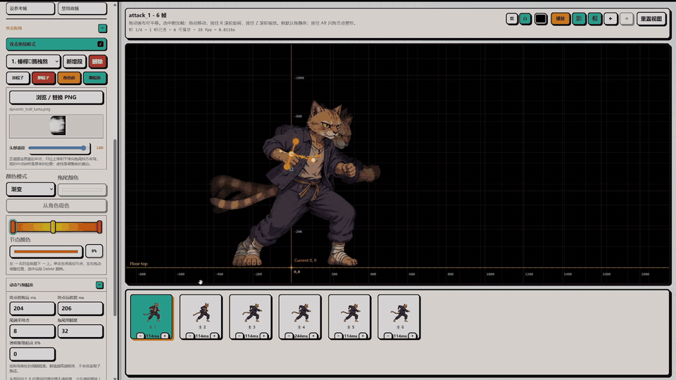

# XSXB Frame Tuner

XSXB Frame Tuner 是一个给 Godot 帧动画角色和 Codex 宠物用的本地调参工作台，配套一个 Codex/Agent skill。它让 Agent 负责导入、同步和验证素材，让人在网页里直观看帧、拖动角色、调碰撞框；Godot 动画保存回游戏项目，Codex 自定义宠物保存回宠物图集。


## 功能

- 多项目隔离：每个 Godot 项目使用独立的 manifest、tuning、音频绑定、图片挂件和导入素材目录。
- Codex 宠物项目：自动收集当前 Codex 版本的内置宠物和 `~/.codex/pets` 下的自定义宠物，同时支持 8×9 的 v1 图集和带 16 个视线方向帧的 8×11 v2 图集。
- 宠物导入与回写：可直接导入合规 WebP 作为新宠物；自定义宠物保存时回写 `spritesheet.webp` 并保留 `spritesheet.xsxb-backup.webp`，内置宠物保持只读。
- 一句话批量导入：Agent 可以把同一条消息里的多组 PNG 动画作为一个批次导入到同一角色，并统一核对组数和帧数。
- 帧动画预览：支持逐帧选择、播放、暂停、参考帧、黑/白/透明背景和网格坐标。
- 三层变换：角色级、动画组级、单帧级分别保存缩放、偏移、旋转和禁用状态。
- 碰撞框调节：支持 hurtbox、hitbox、collisionbox，在画布中直接拖动和变形。
- 播放调节：支持组级时长、单帧时长、禁用帧，以及调参后的实际播放节奏。
- 帧音效和图片挂件：可以给指定帧绑定 SFX 或附加图片，保存后同步到 Godot 项目。
- 攻击拖尾模式：用逐帧棍子绘制连续运动路径，支持多段拖尾、前后图层穿插、自由方向手柄、头部弧度、单色/渐变/原色纹理以及与真实帧时间同步的尾部追赶。
- Godot 同步：导入 PNG 序列或 SpriteFrames 后，会生成/刷新 `res://xsxb_frame_tuner/` 下的运行时数据和基础 runtime。
- 完整验证：可检查每帧框体、游戏本地数据、SFX、附加帧、场景系数、框体缩放和实际 gameplay 接线。

这个仓库不包含任何角色 PNG、音频、Godot 私有项目路径或调参数据。运行时产生的项目数据会留在本机，并被 `.gitignore` 排除。

## 攻击拖尾模式

选择角色和动作后开启“攻击拖尾模式”，即可在当前动画帧上添加一根或多根棍子。棍子的两个端点决定拖尾宽度，中点用于整体移动，方向手柄控制贴图头部穿过棍子后的运动方向和曲率。棍子按时间顺序组成连续路径，同一帧可以放置多根棍子补足被抽掉的中间姿态。

- 每根棍子都可独立切换“角色前方/角色后方”，因此一段拖尾可以在运动途中穿过角色图层。
- 每个动作可以保存多段互不相关的拖尾；纹理、颜色、渐变节点、头部弧度、透明渐隐、收拢时间和细腻度都可以重新编辑。
- 拖尾时间复用动画的 FPS、单帧 duration 和 disabled frame；修改帧时间后不需要重画路径。
- 默认附带 `dynamic_trail_luma.png` 预设。切换到没有配置过拖尾的动作时也能直接预览；只有新增自定义段或替换样式时才需要选择新的 PNG。
- 单色和渐变模式保留原贴图的灰度笔刷细节；原色模式要求带有效 Alpha 的 RGBA PNG。
- 保存时会写入独立攻击拖尾数据、复制稳定纹理并同步 Godot 连续网格运行时。拖尾路径只由棍子定义，不继承单帧 Sprite 的位移或缩放。
- “拖尾细腻度”默认值为 20，适合作为大多数帧动画的质量/性能平衡点；数值越高，弯曲更细但网格更新成本也更高。

[](docs/media/attack-trail-editor-demo.mp4)

README 会直接播放上方的轻量动态预览；点击动画可打开完整 720p MP4 演示。

## 仓库内容

- `tools/animation_tuner/`：本地 Webapp，默认服务地址是 `http://127.0.0.1:5179`。
- `tools/import_frames.js`：Agent 用来导入 PNG 序列的内部工具。
- `tools/import_batch.js`：Agent 用来一次导入多组 PNG 动画的内部工具。
- `tools/import_spriteframes.js`：Agent 用来从 Godot `.spriteframes.tres` 导入动画的内部工具。
- `tools/validate_import.js`：验证独立 tuner 与 Godot 项目的完整接线结果。
- `tools/godot_sync.js` 和 `tools/godot_runtime.js`：把调参数据、素材和 runtime 同步到 Godot 项目。
- `skills/xsxb-frame-tuner/`：配套 Codex/Agent skill。
- `data/`、`workspace/`、`audio/`：本地运行时目录。真实项目数据不提交。

## 安装方式

只提供 Agent 安装方式。把下面这段话交给 Codex 或其他支持 skills 的 Agent：

```text
请从 https://github.com/sparklecatta-lang/XSXB-Frame-Tuner 安装并启用 `skills/xsxb-frame-tuner`。
安装后把仓库克隆到本机作为 XSXB Frame Tuner 工具根目录。
以后处理 Godot 帧动画角色导入、动画追加、碰撞框调参、音效/挂件同步时，默认使用 `$xsxb-frame-tuner`。
```

## 使用方式

安装后，建议继续用自然语言让 Agent 操作，不需要手动跑导入脚本。常用说法：

```text
用 $xsxb-frame-tuner 把 <Godot项目路径> 里的角色 SpriteFrames 接入 tuner。
```

```text
用 $xsxb-frame-tuner 给 <Godot项目路径> 的 hero 添加 idle 动画，PNG 序列在 <PNG序列路径>，12fps，导入后打开 tuner。
```

```text
用 $xsxb-frame-tuner 给 <Godot项目路径> 的 hero 一次加入 idle、run、jump、stand_attack，路径分别是 <四个PNG目录>，导入后检查每组框体并完整接入游戏。
```

```text
用 $xsxb-frame-tuner 检查当前 Godot 项目的 XSXB runtime 是否和 tuner 保存的数据一致。
```

启动 Tuner 后，项目列表中的“Codex 宠物”会自动显示本机内置及自定义宠物。外部用 Hatch Pet 新建宠物后点击“刷新动画列表”即可看到；也可以点“导入新宠物”加入一个 1536×1872（v1）或 1536×2288（v2）的 WebP 图集。

Agent 会负责选择/创建 XSXB 项目、批量复制帧素材、生成 manifest、逐组检查初始框体、同步完整 runtime 到 Godot、连接实际 gameplay，并在验证通过后启动 Webapp。打开页面后，人可以继续做艺术性微调并点击保存。

## 本地数据

本机生成的数据默认放在这些位置：

```text
data/projects/<project_id>/
workspace/projects/<project_id>/assets/
audio/projects/<project_id>/
```

这些目录会保存项目绑定、导入帧、attachments、音效和调参结果。它们默认不会进入 Git 仓库。

## 维护验证

代码没有外部运行依赖，只需要 Node.js。维护者可以让 Agent 执行项目检查，检查内容等价于：

```powershell
npm run check
npm test
```

对已绑定的 Godot 项目还可以运行：

```powershell
node tools\validate_import.js --project <xsxb_project_id> --project-root "<Godot项目路径>" --require-gameplay --strict
```

## 自动更新

Tuner 页面每次打开后会检查官方 GitHub `main` 分支。发现新版本时，页面顶部会显示“更新并重启”按钮；点击后会快进更新本地 Tuner、同步仓库自带的 `xsxb-frame-tuner` skill、重启本地服务并自动重新连接。

为保护本地工作，自动更新只接受官方仓库、`main` 分支和没有未提交代码修改的工作区；Tuner 内有未保存的调参时按钮也会保持禁用。运行时项目数据和未跟踪素材不会被覆盖。

## License

MIT

<!-- updater smoke-test marker -->
